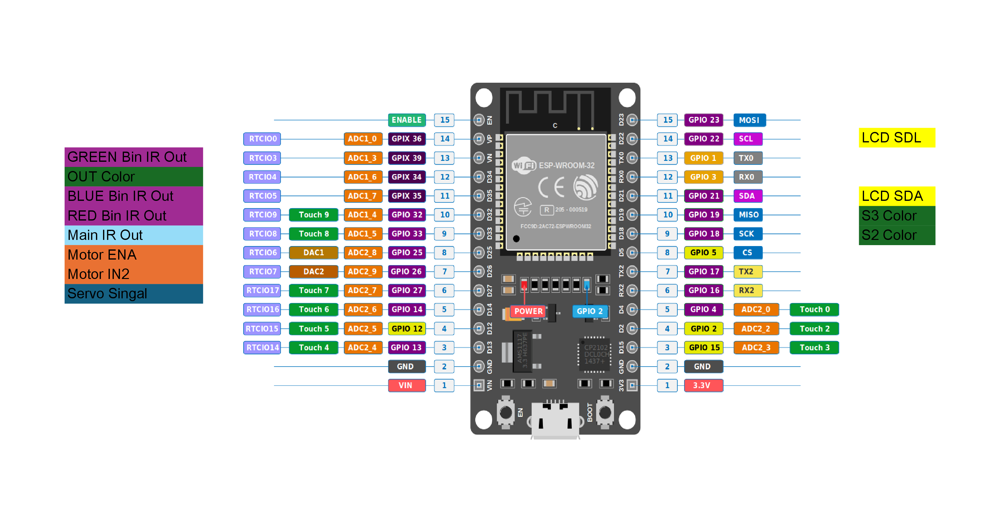
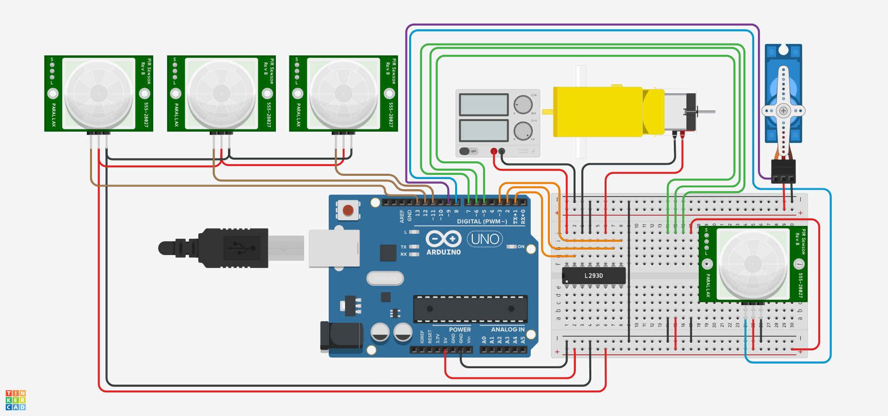

# Embedded Luggage Handling System

An embedded systems project that implements an automated object sorting mechanism using a microcontroller-based control system, motor driver module, and sensor-based detection.

This project demonstrates practical integration of:

- Embedded C / Arduino programming  
- Sensor interfacing  
- Motor control using PWM  
- Hardware system design  
- Mechanical structure modeling (3D design)  

---

## Project Overview

The **Sorting System** is designed to:

1. Detect an object placed in the system  
2. Identify its category (based on the color)  
3. Position the servo motor
4. Drop the object into the correct bin  
5. Return to the default position for the next object  

The system integrates hardware and software to create a fully functional automated sorting solution.

---

## System Architecture

### Hardware Components

- Microcontroller (ESP32)
- Motor Driver Module (HW-095 / L298N)
- DC Motors
- IR Sensors
- Power Supply (Battery)
- Mechanical sorting frame

---

## Pin Configuration

---

## Circuit Diagram

It includes:
- Motor driver connections  
- Sensor wiring  
- Power routing  
- Control signal mapping  

## 3D Mechanical Design

The mechanical structure was designed to:

- Provide stable bin alignment  
- Allow smooth rotation/movement  
- Ensure accurate object dropping  
- Support battery and controller mounting

---

## Software Logic

The core program performs:

1. System initialization  
2. Sensor reading  
3. Decision logic processing  
4. Motor control using PWM  
5. Return-to-home positioning  

### Key Concepts Used

- Digital Input Handling  
- PWM Speed Control  
- Conditional Logic  
- State-based Flow Control  
- Hardware-Software Integration  

---
